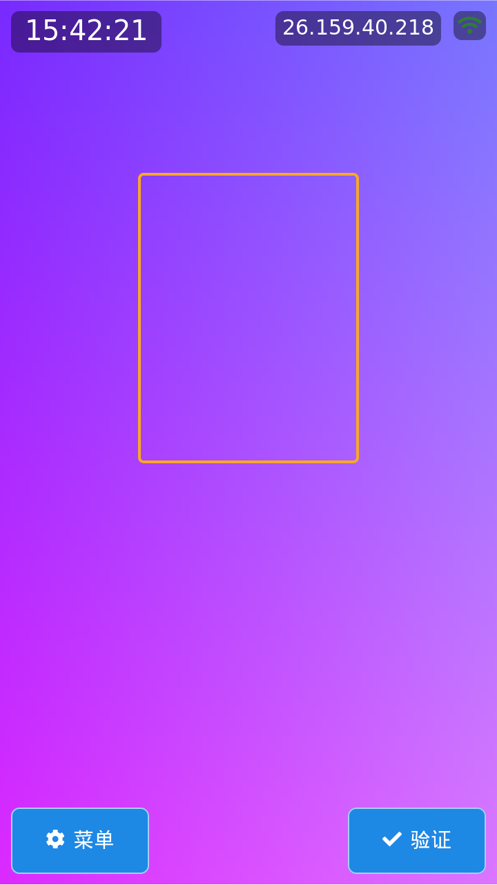
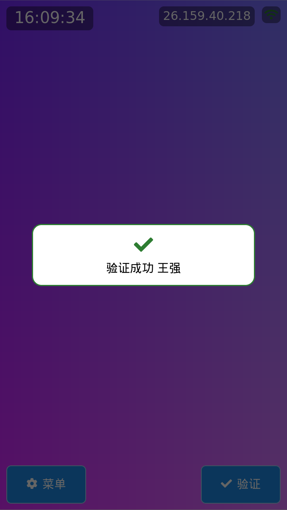
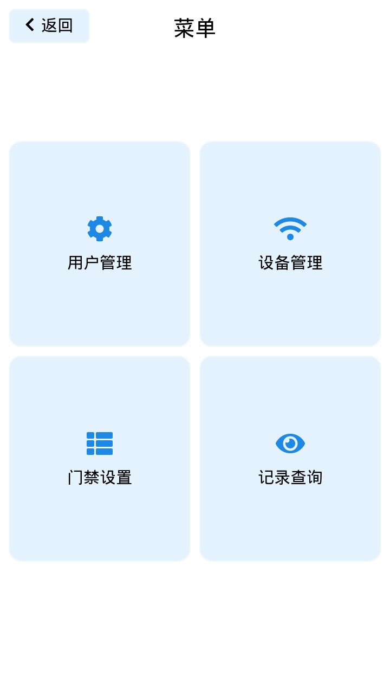
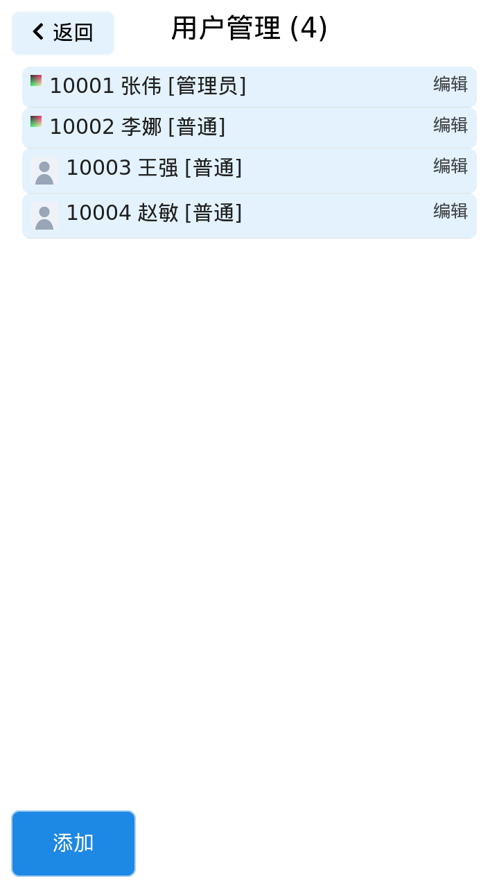
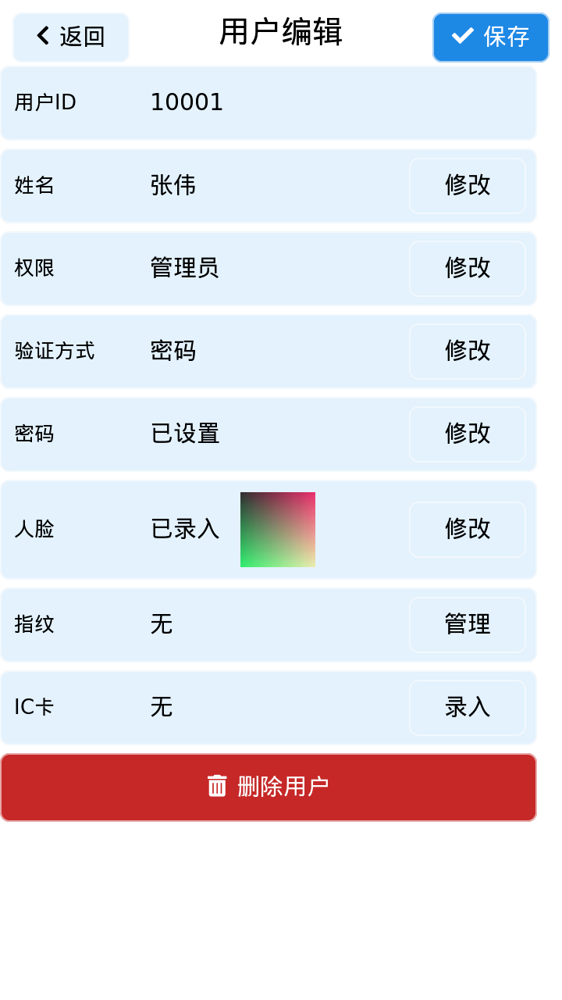
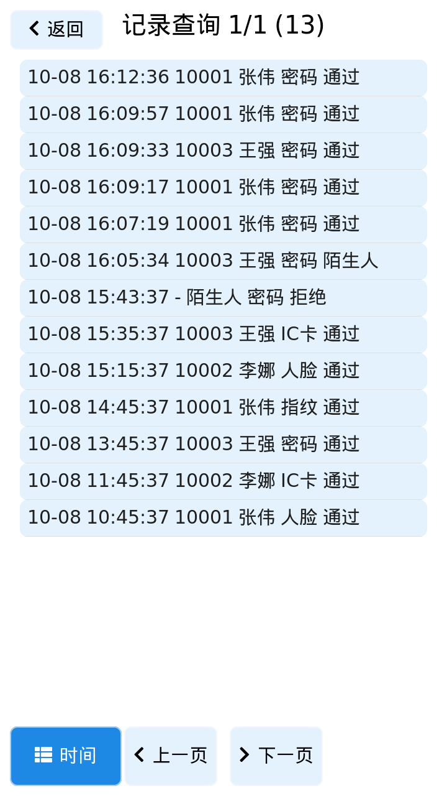

# RK3576 K7 人脸识别门禁 — 全栈自研

KickPi K7(RK3576,6 TOPS NPU)+ 5 寸 MIPI 屏(F050008M01,720×1280)+ IMX415 摄像头。
从 Buildroot 固件裁剪、DTS 屏幕触摸使能、交叉编译工具链,到 NPU 人脸识别链路
(检测 + 识别 + 反欺骗活体)、LVGL9 无桌面 UI、SQLite 业务存储、Vue3 Web 上位机、
OTA A/B 升级与 MQTT 接入,单仓打通固件 → 驱动 → 算法 → 应用 → 上位机全栈。

## 界面实拍

720×1280,LVGL9 UI,模拟器截图(与板端同构,注入触摸逐页走查)。

| 主页(1:N 人脸检测) | 验证成功弹窗 |
|---|---|
|  |  |
| **功能菜单** | **用户管理** |
|  |  |
| **用户编辑(人脸已录入)** | **记录查询(开门日志)** |
|  |  |

更多截图见 `deliverables/ui-walkthrough/`(含多因子验证方式选择弹窗)。

## 仓库内容

```
├── docs/                    开发文档
│   ├── DEV_HANDBOOK.md      软件开发手册(硬件事实/编译环境/踩坑索引)
│   ├── DEVLOG.md            开发日志(过程与坑,按日追加)
│   └── tech/                技术文档(FLASHING 烧录 / TOOLCHAIN 交叉编译 /
│                            FINGERPRINT、ICCARD 硬件协议 / MODULE_DEV_GUIDE)
├── board/                   板端 rootfs 定制(S60 开机服务脚本)
├── env/                     WSL 编译/部署/OTA/测试脚本(source env/env.sh 后 dg-* 直接可用)
├── door-guard/              门禁应用源码(LVGL9 UI / 业务服务 / 内嵌 Web 上位机)
├── deliverables/            产物:UI 走查截图(deliverables/ui-walkthrough/)
│                            + 固件/工具链包元数据(大二进制不进 git)
├── sdk-guide/               官方 SDK 开发资源指南(阅读地图)
├── sdk-patches/             对官方 SDK 的全部修改,以 git patch 管理
└── tools/                   板上走查/性能取证工具与活体模型转换脚本
```
